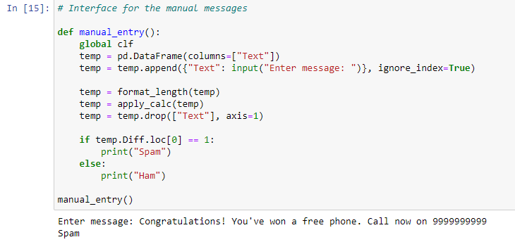

# SMS-Spam-Detection
Classify SMS into Ham and Spam based on corpus provided by Kaggle; "SMS Spam Collection Dataset" using various models.

The jupyter notebook contains complete code for pre-processing the data, training the models and performing a test on custom data.

Sample: 

---

*You are free to integrate the code in your application. 
However, if you're resharing your application, I would appreciate if you link the repository and provide credits :)*
